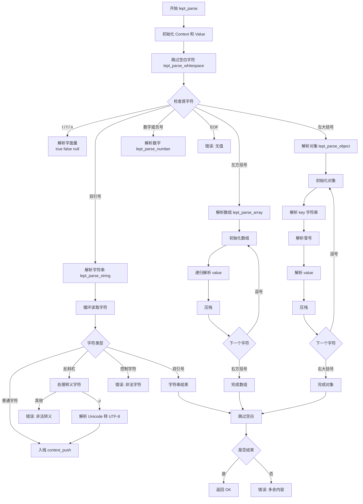
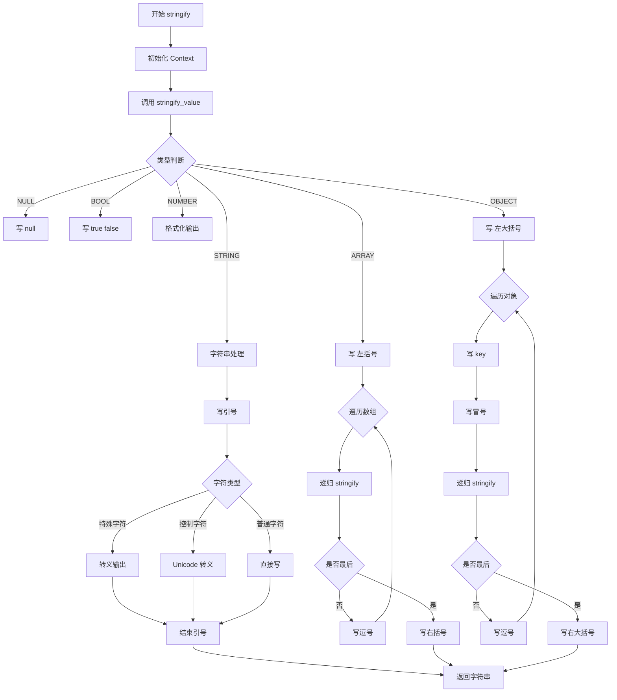

# Json

a simple JSON library for C/C++ based on https://github.com/miloyip/json-tutorial.git

## 解析流程

### 解析json


### 生成json


## 测试结果

```Shell
gcc -Wall -ggdb -W -O -Iinclude  -I/usr/include/tirpc -o output/main build/leptjson.o build/test08.o  -Llib -lpthread -ltirpc
Build complete
./output/main
552/552 (100.00%) passed
```